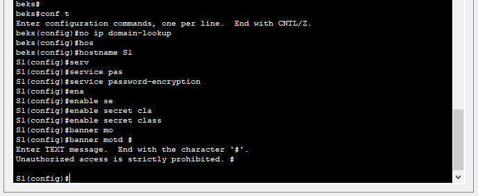
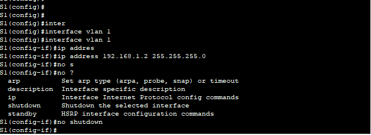
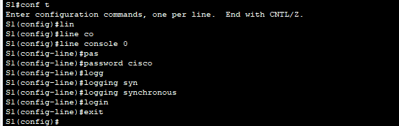
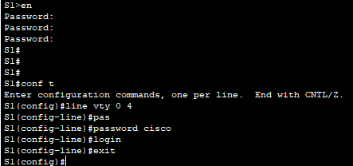
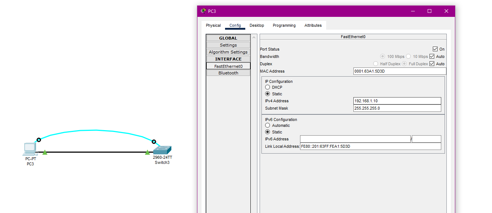
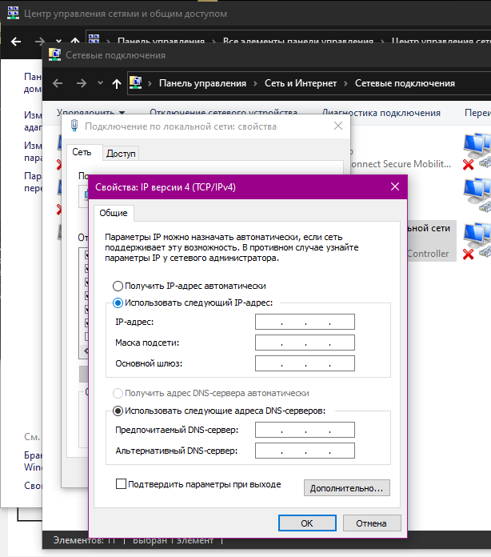

## Часть 2. Создание сети и настройка основных параметров устройства
###	Настройте базовые параметры коммутатора.

Назначьте IP-адрес интерфейсу SVI на коммутаторе. Благодаря этому вы получите возможность удаленного управления коммутатором.

Доступ через порт консоли также следует ограничить  с помощью пароля

Пароль для VTY

###	Настройте IP-адрес на компьютере PC-A.

Настройка в CPK/

Настройка как в примере.