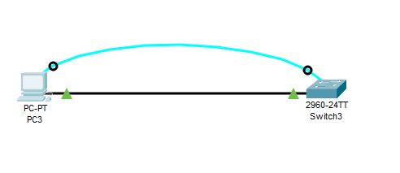

# Топология

# Таблица адресации
Устройство	| Интерфейс	| IP-адрес / префикс
----------- | --------- | -------------
S1	        | VLAN 1	| 192.168.1.2 /24
PC-A	    | NIC	    | 192.168.1.10 /24

# Содержание
## Часть 1. Проверка конфигурации коммутатора по умолчанию
## Часть 2. Создание сети и настройка основных параметров устройства
###	Настройте базовые параметры коммутатора.
###	Настройте IP-адрес для ПК.
## Часть 3. Проверка сетевых подключений
###	Отобразите конфигурацию устройства.
###	Протестируйте сквозное соединение, отправив эхо-запрос.
###	Протестируйте возможности удаленного управления с помощью Telnet.

# Ответы
## Часть 1. Проверка конфигурации коммутатора по умолчанию

Изучите текущий файл running configuration.
- Сколько интерфейсов FastEthernet имеется на коммутаторе 2960?
    - 24
- Сколько интерфейсов Gigabit Ethernet имеется на коммутаторе 2960?
    - 2
- Каков диапазон значений, отображаемых в vty-линиях?
    - 0-4 5-15

Изучите файл загрузочной конфигурации (startup configuration), который содержится в энергонезависимом ОЗУ (NVRAM).
- Почему появляется это сообщение?
    - Потому что не сохранён конфиг загурзки

Изучите характеристики SVI для VLAN 1.

- Назначен ли IP-адрес сети VLAN 1?
    - нет
- Какой MAC-адрес имеет SVI?
    - Мак адерса нет
- Данный интерфейс включен?
   - Выключен


Изучите IP-свойства интерфейса SVI сети VLAN 1.
- Какие выходные данные вы видите?
    - Ip-adress:unassigned OK:YES  Method:manual Status:administratively down Protocol:down

Подсоедините кабель Ethernet компьютера PC-A к порту 6 на коммутаторе и изучите IP-свойства интерфейса SVI сети VLAN 1. Дождитесь согласования параметров скорости и дуплекса между коммутатором и ПК.
- Какие выходные данные вы видите?

Изучите сведения о версии ОС Cisco IOS на коммутаторе.
- Под управлением какой версии ОС Cisco IOS работает коммутатор?
    - 12.2
- Как называется файл образа системы?
    - 2960-lanbase-mz.122-25.FX.bin
- Какой базовый MAC-адрес назначен коммутатору?
    - 00D0.FFB6.0857

Изучите свойства по умолчанию интерфейса FastEthernet, который используется компьютером PC-A.
```Switch# show interface f0/6 ```

- Интерфейс включен или выключен?
    - выключен
- Что нужно сделать, чтобы включить интерфейс?
    - no shutdown
- Какой MAC-адрес у интерфейса?
    - 0060.476d.6506
- Какие настройки скорости и дуплекса заданы в интерфейсе?
    - 100Mb/s

Изучите параметры сети VLAN по умолчанию на коммутаторе.
- Какое имя присвоено сети VLAN 1 по умолчанию?
    - default
- Какие порты расположены в сети VLAN 1?
    - Fa0/1, Fa0/2, Fa0/3, Fa0/4, Fa0/5, Fa0/6, Fa0/7, Fa0/8, Fa0/9, Fa0/10, Fa0/11, Fa0/12, Fa0/13, Fa0/14, Fa0/15, Fa0/16, Fa0/17, Fa0/18, Fa0/19, Fa0/20, Fa0/21, Fa0/22, Fa0/23, Fa0/24, Gig0/1, Gig0/2

- Активна ли сеть VLAN 1?
    - Active
- К какому типу сетей VLAN принадлежит VLAN по умолчанию?
    - Native VLAN

Изучите флеш-память.
Выполните одну из следующих команд, чтобы изучить содержимое флеш-каталога.

```Switch# show flash ```

- Какое имя присвоено образу Cisco IOS?
    - 2960-lanbase-mz.122-25.FX.bin

## Настройте базовые параметры коммутатора.

- Для чего нужна команда login?
    - Что бы разрешить вход под указаным паролем

## Отобразите конфигурацию коммутатора.

Проверьте параметры VLAN 1.

```S1# show interface vlan 1 ```

- Какова полоса пропускания этого интерфейса?
    - 1500
- В каком состоянии находится VLAN 1?
    - Up
- В каком состоянии находится канальный протокол?
    - Upexit


## Протестируйте сквозное соединение, отправив эхо-запрос


## Проверьте удаленное управление коммутатором S1


- Зачем необходимо настраивать пароль VTY для коммутатора?
    - Что бы была возможность подключиться по Telnet
- Что нужно сделать, чтобы пароли не отправлялись в незашифрованном виде?
    - service password-encryption
