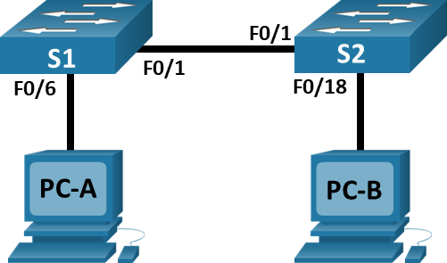
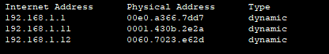
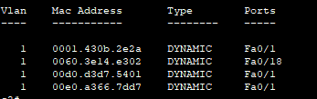
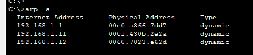

# Топология



# Таблица адресации
Устройство	| Интерфейс	| IP-адрес	    | Маска подсети
----------- | --------- | ------------- | -------------
S1	        |VLAN 1     |192.168.1.11   |	255.255.255.0
S2	        |VLAN 1     |192.168.1.12   |	255.255.255.0
PC-A        |NIC        |192.168.1.1    |	255.255.255.0
PC-B        |NIC        |192.168.1.2    |	255.255.255.0

# Цели
- Часть 1. Создание и настройка сети
- Часть 2. Изучение таблицы МАС-адресов коммутатора

## Инструкции
### Часть 1. Создание и настройка сети
### Подключите сеть в соответствии с топологией.
### Настройте узлы ПК.
### Выполните инициализацию и перезагрузку коммутаторов.
### Настройте базовые параметры каждого коммутатора.
### Откройте окно конфигурации
- Настройте имена устройств в соответствии с топологией.
- Настройте IP-адреса, как указано в таблице адресации.
- Назначьте cisco в качестве паролей консоли и VTY.
- Назначьте class в качестве пароля доступа к привилегированному режиму EXEC.

## Часть 2. Изучение таблицы МАС-адресов коммутатора
Как только между сетевыми устройствами начинается передача данных, коммутатор выясняет МАС-адреса и строит таблицу.

Запишите МАС-адреса сетевых устройств. Откройте командную строку на PC-A и PC-B и введите команду ipconfig /all. Открытие окна командной строки Windows

- Назовите физические адреса адаптера Ethernet.
    - MAC-адрес компьютера PC-A:  00E0.A366.7DD7
    - MAC-адрес компьютера PC-B: 0060.3E14.E302

Закройте окно командной строки. Подключитесь к коммутаторам S1 и S2 через консоль и введите команду show interface F0/1 на каждом коммутаторе. Откройте окно конфигурации

- Назовите адреса оборудования во второй строке выходных данных команды (или зашитый адрес — bia).
    - МАС-адрес коммутатора S1 Fast Ethernet 0/1:  00d0.d3d7.5401
    - МАС-адрес коммутатора S2 Fast Ethernet 0/1 :00d0.bc55.6401

Закройте окно настройки. Просмотрите таблицу МАС-адресов коммутатора. Подключитесь к коммутатору S2 через консоль и просмотрите таблицу МАС-адресов до и после тестирования сетевой связи с помощью эхо-запросов. Подключитесь к коммутатору S2 через консоль и войдите в привилегированный режим EXEC. Откройте окно конфигурации В привилегированном режиме EXEC введите команду show mac address-table и нажмите клавишу ввода.

```S2# show mac address-table```

Даже если сетевая коммуникация в сети не происходила (т. е. если команда ping не отправлялась), коммутатор может узнать МАС-адреса при подключении к ПК и другим коммутаторам.

- Записаны ли в таблице МАС-адресов какие-либо МАС-адреса?
    - Да
- Какие МАС-адреса записаны в таблице?
    - 00d0.d3d7.5401
- С какими портами коммутатора они сопоставлены и каким устройствам принадлежат?
    - Fa0/1 интерфейс Vlan1

Игнорируйте МАС-адреса, сопоставленные с центральным процессором.

- Если вы не записали МАС-адреса сетевых устройств в шаге 1, как можно определить, каким устройствам принадлежат МАС-адреса, используя только выходные данные команды show mac address-table?
    - В поле Ports указано кому пренаджелит MAC Address

Очистите таблицу МАС-адресов коммутатора S2 и снова отобразите таблицу МАС-адресов. В привилегированном режиме EXEC введите команду clear mac address-table dynamic и нажмите клавишу Enter.

```S2# clear mac address-table dynamic```

Снова быстро введите команду show mac address-table.

- Указаны ли в таблице МАС-адресов адреса для VLAN 1?
    - Нет
- Указаны ли другие МАС-адреса?
    - Нет

Через 10 секунд введите команду show mac address-table и нажмите клавишу ввода.
- Появились ли в таблице МАС-адресов новые адреса?
    - Новые не появились, появился только старый Мак адрес

С компьютера PC-B отправьте эхо-запросы устройствам в сети и просмотрите таблицу МАС-адресов коммутатора. На компьютере PC-B откройте командную строку и еще раз введите команду arp -a. Откройте командную строку.

- Не считая адресов многоадресной и широковещательной рассылки, сколько пар IP- и МАС-адресов устройств было получено через протокол ARP?
    - 3

    


Из командной строки PC-B отправьте эхо-запросы на компьютер PC-A, а также коммутаторы S1 и S2.

- От всех ли устройств получены ответы?
    - От всех

Закройте командную строку. Подключившись через консоль к коммутатору S2, введите команду show mac address-table. Откройте окно конфигурации

- Добавил ли коммутатор в таблицу МАС-адресов дополнительные МАС-адреса?
    - Да

    

На компьютере PC-B откройте командную строку и еще раз введите команду arp -a.

- Появились ли в ARP-кэше компьютера PC-B дополнительные записи для всех сетевых устройств, которым были отправлены эхо-запросы?
    - Нет
    

Закройте командную строку.

## Вопрос для повторения
- В сетях Ethernet данные передаются на устройства по соответствующим МАС-адресам. Для этого коммутаторы и компьютеры динамически создают ARP-кэш и таблицы МАС-адресов. Если компьютеров в сети немного, эта процедура выглядит достаточно простой. Какие сложности могут возникнуть в крупных сетях?
    - Большое количество запросов ARP может затормозить работу сети.