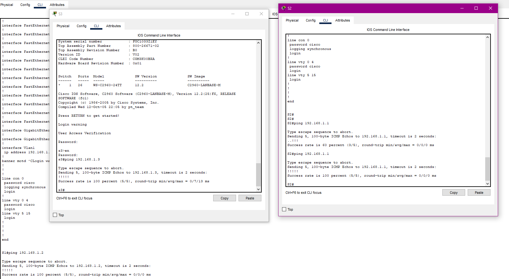
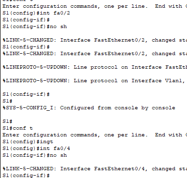
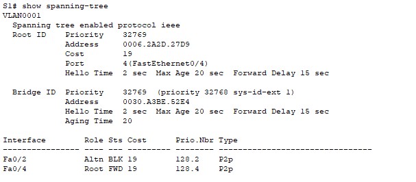
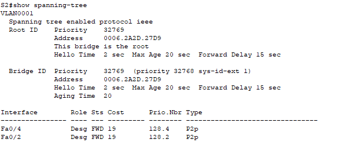
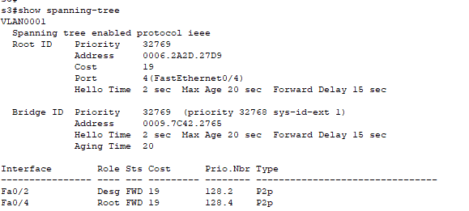
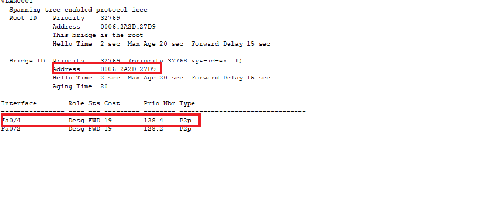
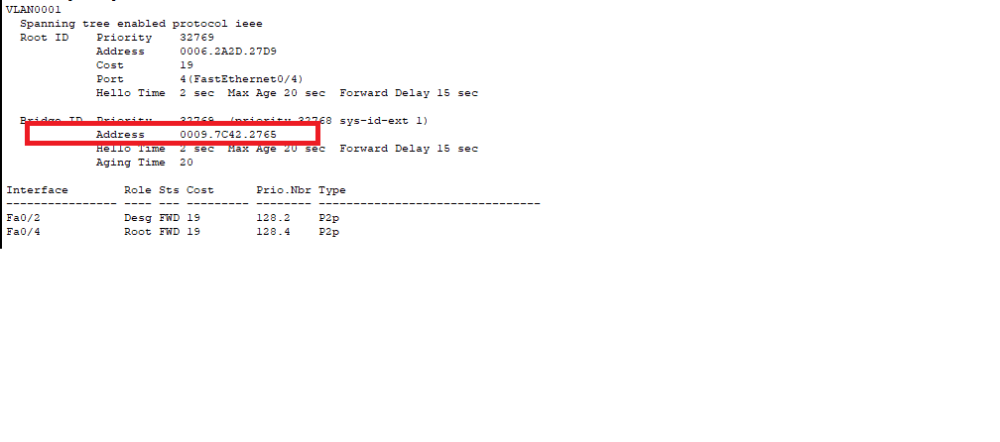
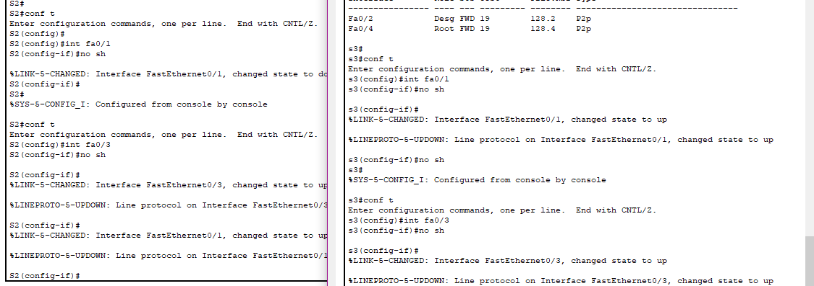

# Лабораторная работа. Развертывание коммутируемой сети с резервными каналами

## Топология


## Таблица адресации

Устройство | Интерфейс | IP-адрес | Маска подсети
---------- | --------- | -------- | -------------
S1         | VLAN 1 | 192.168.1.1 | 255.255.255.0
S2         | VLAN 1 | 192.168.1.2 | 255.255.255.0
S3         | VLAN 1 | 192.168.1.3 | 255.255.255.0

## Цели

* Часть 1. Создание сети и настройка основных параметров устройства
* Часть 2. Выбор корневого моста
* Часть 3. Наблюдение за процессом выбора протоколом STP порта, исходя из стоимости портов
* Часть 4. Наблюдение за процессом выбора протоколом STP порта, исходя из приоритета портов

## Общие сведения/сценарий

Избыточность позволяет увеличить доступность устройств в топологии сети за счёт устранения единой точки отказа. Избыточность в коммутируемой сети обеспечивается посредством использования нескольких коммутаторов или нескольких каналов между коммутаторами. Когда в проекте сети используется физическая избыточность, возможно возникновение петель и дублирование кадров.

Протокол spanning-tree (STP) был разработан как механизм предотвращения возникновения петель на 2-м уровне для избыточных каналов коммутируемой сети. Протокол STP обеспечивает наличие только одного логического пути между всеми узлами назначения в сети путем намеренного блокирования резервных путей, которые могли бы вызвать петлю.

В этой лабораторной работе команда ```show spanning-tree``` используется для наблюдения за процессом выбора протоколом STP корневого моста. Также вы будете наблюдать за процессом выбора портов с учетом стоимости и приоритета.

__Примечание__ Используются коммутаторы Cisco Catalyst 2960s с Cisco IOS версии 15.0(2) (образ lanbasek9). Допускается использование других моделей коммутаторов и других версий Cisco IOS. В зависимости от модели устройства и версии Cisco IOS доступные команды и результаты их выполнения могут отличаться от тех, которые показаны в лабораторных работах.

__Примечание__ Убедитесь, что все настройки коммутатора удалены и загрузочная конфигурация отсутствует. Если вы не уверены, обратитесь к инструктору.

## Необходимые ресурсы

* 3 коммутатора (Cisco 2960 с операционной системой Cisco IOS 15.0(2) (образ lanbasek9) или аналогичная модель)
* Консольные кабели для настройки устройств Cisco IOS через консольные порты
* Кабели Ethernet, расположенные в соответствии с топологией

## Часть 1: Создание сети и настройка основных параметров устройства

В части 1 вам предстоит настроить топологию сети и основные параметры маршрутизаторов.

### Шаг 1: Создайте сеть согласно топологии

Подключите устройства, как показано в топологии, и подсоедините необходимые кабели.

### Шаг 2: Выполните инициализацию и перезагрузку коммутаторов

### Шаг 3: Настройте базовые параметры каждого коммутатора

Отключите поиск DNS.


Присвойте имена устройствам в соответствии с топологией.


Назначьте __class__ в качестве зашифрованного пароля доступа к привилегированному режиму.


Назначьте __cisco__ в качестве паролей консоли и VTY и активируйте вход для консоли и VTY каналов.


Настройте logging synchronous для консольного канала.


Настройте баннерное сообщение дня (MOTD) для предупреждения пользователей о запрете несанкционированного доступа.


Задайте IP-адрес, указанный в таблице адресации для VLAN 1 на всех коммутаторах.


Скопируйте текущую конфигурацию в файл загрузочной конфигурации.


### Шаг 4: Проверьте связь

Проверьте способность компьютеров обмениваться эхо-запросами.

* Успешно ли выполняется эхо-запрос от коммутатора S1 на коммутатор S2?
  * __да__
* Успешно ли выполняется эхо-запрос от коммутатора S1 на коммутатор S3?
  * __да__
* Успешно ли выполняется эхо-запрос от коммутатора S2 на коммутатор S3?
  * __да__

Выполняйте отладку до тех пор, пока ответы на все вопросы не будут положительными.



## Часть 2: Определение корневого моста

Для каждого экземпляра протокола spanning-tree (коммутируемая сеть LAN или широковещательный домен) существует коммутатор, выделенный в качестве корневого моста. Корневой мост служит точкой привязки для всех расчётов протокола spanning-tree, позволяя определить избыточные пути, которые следует заблокировать.

Процесс выбора определяет, какой из коммутаторов станет корневым мостом. Коммутатор с наименьшим значением идентификатора моста (BID) становится корневым мостом. Идентификатор BID состоит из значения приоритета моста, расширенного идентификатора системы и MAC-адреса коммутатора. Значение приоритета может находиться в диапазоне от 0 до 65535 с шагом 4096. По умолчанию используется значение 32768.

### Шаг 1: Отключите все порты на коммутаторах


### Шаг 2: Настройте подключенные порты в качестве транковых


### Шаг 3: Включите порты F0/2 и F0/4 на всех коммутаторах



### Шаг 4: Отобразите данные протокола spanning-tree

Введите команду ```show spanning-tree``` на всех трех коммутаторах. Приоритет идентификатора моста рассчитывается путем сложения значений приоритета и расширенного идентификатора системы.
Расширенным идентификатором системы всегда является номер сети VLAN. В примере ниже все три коммутатора имеют равные значения приоритета идентификатора моста (32769 = 32768 + 1, где приоритет по умолчанию = 32768, номер сети VLAN = 1); следовательно, коммутатор с самым низким значением MAC-адреса становится корневым мостом (в примере — S2).

```S1# show spanning-tree```



```S2```



```S3```



__Примечание__ Режим STP по умолчанию на коммутаторе 2960 — протокол STP для каждой сети VLAN (PVST).

В схему ниже запишите роль и состояние (Sts) активных портов на каждом коммутаторе в топологии.


__Root- корневой порт, Desg- назначенный порт, Altn- дополнительный, Back- резервный, FWD- работает__

С учетом выходных данных, поступающих с коммутаторов, ответьте на следующие вопросы.

* Какой коммутатор является корневым мостом?
  * __S1__
* Почему этот коммутатор был выбран протоколом spanning-tree в качестве корневого моста?
  * __Данный коммутатор обладает самым низким значением mac адресса__
* Какие порты на коммутаторе являются корневыми портами?
  * __F0/2 на s2 и F0/4 на S3__
* Какие порты на коммутаторе являются назначенными портами?
  * __Порты F0/4 и F0/2 на S1, F0/2 на S3__
* Какой порт отображается в качестве альтернативного и в настоящее время заблокирован?
  * __F0/4 на коммутаторе S2__

## Часть 3: Наблюдение за процессом выбора протоколом STP порта, исходя из стоимости портов

Алгоритм протокола spanning-tree (STA) использует корневой мост как точку привязки, после чего определяет, какие порты будут заблокированы, исходя из стоимости пути. Порт с более низкой стоимостью пути является предпочтительным. Если стоимости портов равны, процесс сравнивает BID. Если BID равны, для определения корневого моста используются приоритеты портов. Наиболее низкие значения являются предпочтительными. В части 3 вам предстоит изменить стоимость порта, чтобы определить, какой порт будет заблокирован протоколом spanning-tree.

### Шаг 1: Определите коммутатор с заблокированным портом

При текущей конфигурации только один коммутатор может содержать заблокированный протоколом STP порт. Выполните команду ```show spanning-tree``` на обоих коммутаторах некорневого моста. В примере ниже протокол spanning-tree блокирует порт F0/4 на коммутаторе с самым высоким идентификатором BID (S1).

```S1# show spanning-tree```

### Шаг 2: Измените стоимость порта

Помимо заблокированного порта, единственным активным портом на этом коммутаторе является порт, выделенный в качестве порта корневого моста. Уменьшите стоимость этого порта корневого моста до 18, выполнив команду ```spanning-tree vlan 1 cost 18``` режима конфигурации интерфейса.

```S1(config)# interface f0/2```

```S1(config-if)# spanning-tree vlan 1 cost 18```

### Шаг 3: Просмотрите изменения протокола spanning-tree

Повторно выполните команду show spanning-tree на обоих коммутаторах некорневого моста. Обратите внимание, что ранее заблокированный порт (S1 – F0/4) теперь является назначенным портом, и протокол spanning-tree теперь блокирует порт на другом коммутаторе некорневого моста (S3 – F0/4).

```S2# show spanning-tree```


```S3```


### Шаг 4: Удалите изменения стоимости порта

Выполните команду ```no spanning-tree vlan 1 cost 18``` режима конфигурации интерфейса, чтобы удалить запись стоимости, созданную ранее.

```S1(config)# interface f0/2```

```S1(config-if)# no spanning-tree vlan 1 cost 18```

Повторно выполните команду ```show spanning-tree```, чтобы подтвердить, что протокол STP сбросил порт на коммутаторе некорневого моста, вернув исходные настройки порта. Протоколу STP требуется примерно 30 секунд, чтобы завершить процесс перевода порта.

## Часть 4: Наблюдение за процессом выбора протоколом STP порта, исходя из приоритета портов

Если стоимости портов равны, процесс сравнивает BID. Если BID равны, для определения корневого моста используются приоритеты портов. Значение приоритета по умолчанию — 128. STP объединяет приоритет порта с номером порта, чтобы разорвать связи. Наиболее низкие значения являются предпочтительными. В части 4 вам предстоит активировать избыточные пути до каждого из коммутаторов, чтобы просмотреть, каким образом протокол STP выбирает порт с учетом приоритета портов.

Включите порты F0/1 и F0/3 на всех коммутаторах.



Подождите 30 секунд, чтобы протокол STP завершил процесс перевода порта, после чего выполните команду ```show spanning-tree``` на коммутаторах некорневого моста. Обратите внимание, что порт корневого моста переместился на порт с меньшим номером, связанный с коммутатором корневого моста, и заблокировал предыдущий порт корневого моста.

* Какой порт выбран протоколом STP в качестве порта корневого моста на каждом коммутаторе некорневого моста?
  * Порт корневого моста переместился на порт с меньшим номером, связанным с коммутатором корневого моста. Порты Fa0/1 на S2 и Fa0/3 на S3 теперь являются корневыми, т.к.их номер является наименьшим из номеров всех портов
